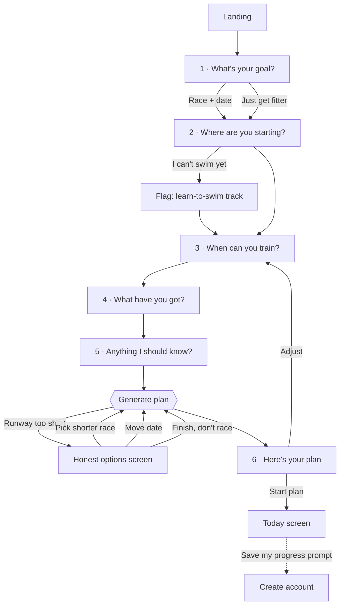
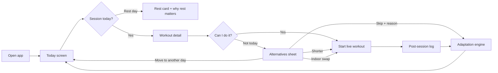
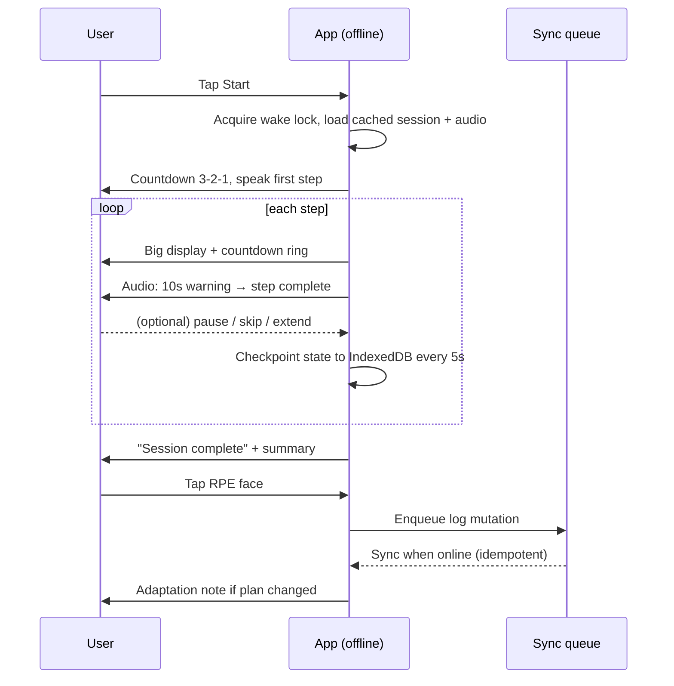
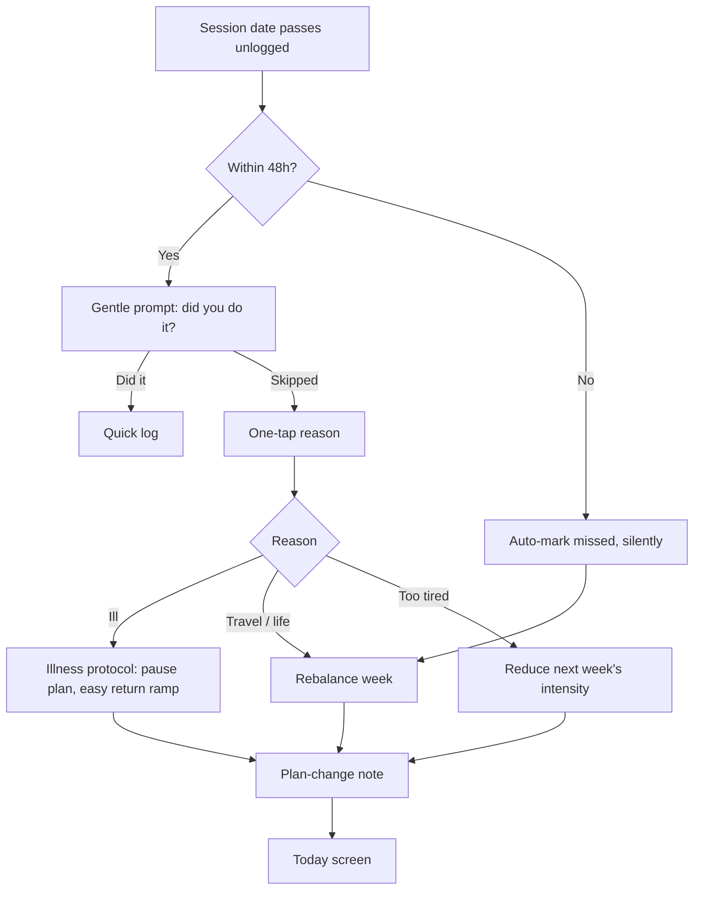
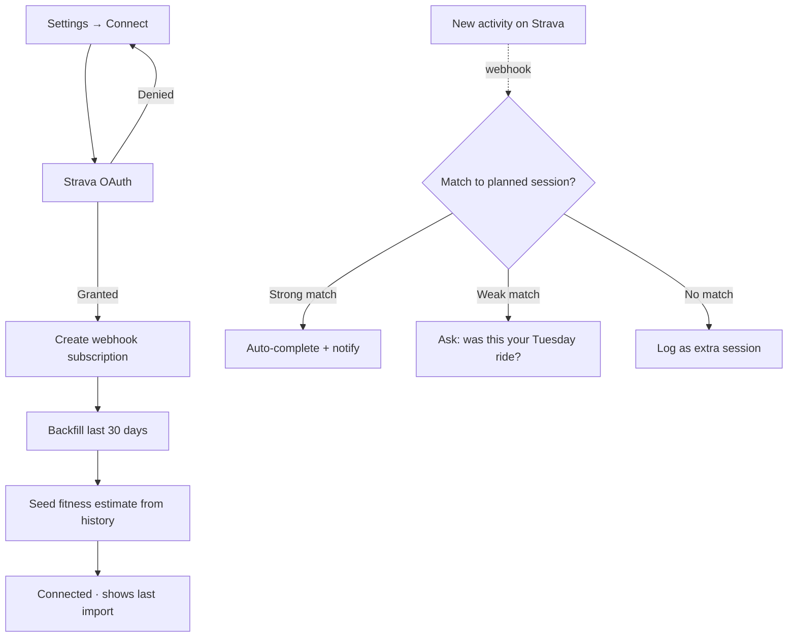

# 02 — User Flows

Flows are written screen-by-screen with the decision points and edge cases that matter for implementation. ASCII wireframes are indicative of *hierarchy and thumb-reach*, not final visual design — see [06-design-system.md](06-design-system.md).

---

## A. Onboarding

The single most important flow in the app. Every extra screen costs users. Target: **90 seconds, zero jargon, no account required.**



### Screen 1 — Goal

```
┌──────────────────────────────┐
│ ●○○○○○                       │
│                              │
│  What are you training for?  │
│                              │
│  ┌────────────────────────┐  │
│  │ 🏊 Sprint              │  │
│  │ 750m · 20km · 5km      │  │
│  │ ~1h20 for most         │  │
│  │ first-timers           │  │
│  └────────────────────────┘  │
│  ┌────────────────────────┐  │
│  │ Super Sprint           │  │
│  │ 400m · 10km · 2.5km    │  │
│  └────────────────────────┘  │
│  ┌────────────────────────┐  │
│  │ Olympic  1.5k·40k·10k  │  │
│  └────────────────────────┘  │
│  ┌────────────────────────┐  │
│  │ Half (70.3) / Full     │  │
│  └────────────────────────┘  │
│                              │
│  I just want to get fitter → │
│                              │
│  ┌────────────────────────┐  │
│  │       Continue         │  │  ← thumb zone
│  └────────────────────────┘  │
└──────────────────────────────┘
```

- Distance cards lead with **what it actually is**, not the name.
- "Not sure which?" opens a 3-question recommender.
- Date step follows: calendar picker, or "I haven't picked a race yet" → asks for a rough month.

### Screen 2 — Starting point

Three compact blocks, one per discipline. Each asks the *easiest possible* question:

| Discipline | Question | Answer type |
|---|---|---|
| Swim | "How far can you swim without stopping?" | Can't swim yet / < 100 m / 100–400 m / 400–1000 m / 1 km+ |
| Bike | "How long can you ride comfortably?" | Never / < 20 min / 20–45 min / 45–90 min / 90 min+ |
| Run | "How long can you run without walking?" | Can't yet / < 10 min / 10–20 min / 20–40 min / 40 min+ |

Plus a one-tap confidence chip per discipline (😰 nervous / 🙂 okay / 💪 confident). Confidence, not just capability, drives which [F-12](01-product-spec.md#f-12--confidence--skills-track--p1) modules surface and how conservative the ramp is.

**Edge case:** "Can't swim yet" is not a failure state. It sets `swim_track = learn_to_swim`, replaces early swim sessions with skills sessions, and — if the race date is too close to learn safely — routes to the honest-options screen with "consider a duathlon or a later race" as a first-class suggestion.

### Screen 3 — Availability

- Day chips (M T W T F S S), multi-select.
- Per-day minutes via a single slider that sets a default, with per-day override on long press.
- "Which days can you go long?" — multi-select from the chosen days.

This is the constraint the generator respects most strictly. Users overestimate here; the app deliberately plans to ~90% of stated availability and tells them so ("I've left you some slack — you can always add").

### Screen 6 — Plan preview

- Headline: *"14 weeks. 4 sessions a week. About 4h30 a week to start, 6h at peak."*
- A phase bar (Prep → Base → Build → Peak → Taper → 🏁) with week counts.
- Week 1 expanded, in full.
- Estimated finish: **1:35 – 1:55**, labelled *estimate, will sharpen as you train*.
- Primary: **Start plan**. Secondary: *Adjust something*.

### Account prompt

Deferred until *after* the plan exists and ideally after the first logged session. Framed as protection, not registration: *"Save your plan so you don't lose it."* Anonymous data migrates in place.

---

## B. The daily loop

The core habit. Optimized so a returning user's most common action is one tap from cold launch.



### Today screen

```
┌──────────────────────────────┐
│ Afraid to Tri          ⚙︎    │
│                              │
│  Week 6 of 14 · Base         │
│  🏁 57 days to Brighton Tri  │
│                              │
│ ┌──────────────────────────┐ │
│ │ 🚴  EASY RIDE            │ │
│ │     45 min · Zone 2      │ │
│ │                          │ │
│ │ Builds the aerobic base  │ │
│ │ everything else sits on. │ │
│ │ You should be able to    │ │
│ │ hold a conversation.     │ │
│ │                          │ │
│ │ ┌──────────────────────┐ │ │
│ │ │      ▶  START        │ │ │
│ │ └──────────────────────┘ │ │
│ │  Details   ·   Not today │ │
│ └──────────────────────────┘ │
│                              │
│  M   T   W   T   F   S   S   │
│  ✓   ✓   ●   ·   🏊  🚴  🏃  │
│                              │
│ ┌──────────────────────────┐ │
│ │ 💡 Your first open-water │ │
│ │    swim is next week —   │ │
│ │    here's what to expect │ │
│ └──────────────────────────┘ │
├──────────────────────────────┤
│  Today  Calendar  Progress  Me│
└──────────────────────────────┘
```

**Rest-day variant** replaces the hero with a rest card: *"Rest day. This is when you actually get fitter — the training only creates the stimulus."* Optional mobility suggestion, never a guilt trip, never an empty state.

**Nudge slot rules:** at most one, priority order —
1. Safety (illness flag follow-up, pain reported yesterday)
2. Unlogged session from the last 48 h
3. Contextual confidence module ([F-12](01-product-spec.md#f-12--confidence--skills-track--p1))
4. Weather warning for today's outdoor session
5. Due fitness test / readiness check-in
6. Milestone celebration

---

## C. Live workout

Everything here assumes: **no signal, moving, sweaty, possibly wet, screen may be off.**



### Active screen

```
┌──────────────────────────────┐
│  ⏸        18:42 elapsed      │
│                              │
│         MAIN SET              │
│                              │
│      ╭───────────────╮       │
│      │               │       │
│      │    2:14       │       │  ← countdown ring
│      │   remaining   │       │
│      ╰───────────────╯       │
│                              │
│    HARD  ·  Zone 4           │
│    "Breathing hard,          │
│     short sentences only"    │
│                              │
│    ♥ 156 bpm  ✓ in zone      │
│                              │
│  Next: 3:00 easy spin        │
│  Interval 3 of 5             │
│                              │
│ ┌─────────┐  ┌─────────────┐ │
│ │  SKIP   │  │   PAUSE     │ │  ← ≥64px
│ └─────────┘  └─────────────┘ │
└──────────────────────────────┘
```

Design rules:
- One number dominates. Everything else is secondary.
- Colour band behind the HR line: below / in / above zone. Never colour alone — text state accompanies it.
- Screen-off is a supported mode: audio cues carry the whole session.
- Swim mode differs: pool sessions are **lap/set-based, not timed**, with a huge "next set" tap target, and assume the phone is on the pool deck.

### Interruptions

| Event | Behaviour |
|---|---|
| Incoming call | Auto-pause, resume prompt on return |
| App backgrounded | Timer continues from wall clock; audio continues |
| App killed | Checkpoint restored on relaunch; resume offered for 6 h |
| Battery < 10% | Offer low-power mode: screen off, audio only |
| User ends early | Log partial, ask why, never mark as failure |

---

## D. Post-session log

Two taps in the common case.

```
┌──────────────────────────────┐
│  Nice work. 45:12 done.      │
│                              │
│  How did that feel?          │
│                              │
│   😌     🙂     😐    😮‍💨   🥵 │
│  Easy   Steady  Work  Hard  Max│
│                              │
│  Body check:                 │
│  [ Fine ] [ Niggle ] [ Pain ]│
│                              │
│  + Add a note                │
│                              │
│ ┌──────────────────────────┐ │
│ │          DONE            │ │
│ └──────────────────────────┘ │
└──────────────────────────────┘
```

- Faces map to RPE bands (1–2 / 3–4 / 5–6 / 7–8 / 9–10).
- **Pain** opens the injury path: reduce load, suggest rest, surface "see a professional" guidance, never diagnose.
- If adaptation changed anything, a dismissible note follows: *"Because that felt hard, I've made Thursday easier. Undo?"*

---

## E. Missed session

The flow that keeps people in the app. Never punitive.



**Rules**
- Never carry more than one missed session forward.
- Never let a rebalance push a week above its ramp cap — drop the lowest-value session instead.
- 3+ consecutive missed days → offer a full re-plan ("Life happened. Want me to rebuild from here?").
- The word "failed" never appears. Neither does a broken-streak animation.

---

## F. Race week

Starts 7 days out; the Today screen changes shape.

| Day | Screen emphasis |
|---|---|
| −7 | Race week banner opens. Taper explainer: *"Training drops now. You'll feel twitchy. That's the point."* |
| −6 to −3 | Short sharpening sessions. Gear checklist card appears, progress-tracked. |
| −2 | Race walkthrough module surfaces. Travel/logistics checklist. |
| −1 | Very short session or rest. Pacing plan revealed. Fuelling plan finalized. Bag-packing checklist by transition bag. |
| Race day | **Race mode**: hour-by-hour morning schedule, pacing targets per leg, checklist, and nothing else. No training UI at all. |
| +1 | Result logging + reflection prompt. |
| +2 to +7 | Guided recovery week, then "what's next?" — repeat distance, step up, or off-season. |

### Race mode

Full-screen, single-purpose, offline-guaranteed (races have terrible signal):

```
┌──────────────────────────────┐
│  🏁 RACE DAY                 │
│  Brighton Sprint Triathlon   │
│                              │
│  05:30  Wake, breakfast      │
│  06:15  Leave                │
│  07:00  Registration ✓       │
│  07:30  Rack bike, set T1 ✓  │
│  08:20  Warm-up swim         │
│  08:45  ▸ YOUR WAVE          │
│                              │
│  Your pacing                 │
│  Swim  aim 18–20 min · easy  │
│  T1    take your time        │
│  Bike  40–44 min · steady    │
│  T2    breathe               │
│  Run   28–31 min · build     │
│                              │
│  Remember: the first one is  │
│  about finishing. Walk if    │
│  you need to. It still counts│
└──────────────────────────────┘
```

---

## G. Connecting Strava



Matching rules and dedupe are specified in [07-integrations.md](07-integrations.md#activity-matching).

---

## H. Coach ↔ athlete *(Phase 4)*

1. Coach invites athlete by email or link → athlete accepts, choosing what to share (plan only / plan + logs / everything).
2. Coach roster shows each athlete's week, adherence, and flags (missed 3+, pain reported, high RPE trend).
3. Coach can assign a plan or edit individual sessions; athlete sees a change note and can accept or discuss.
4. Per-session comment threads, push-notified.
5. Athlete can revoke access at any time from one screen; revocation is immediate and the coach retains no data copy.

---

## Empty & error states

| State | Treatment |
|---|---|
| No plan yet | Full-bleed CTA to onboarding, with a 30-second explainer |
| No data for a chart | Explainer of what the chart will show and when it unlocks |
| Offline | Persistent slim banner; all cached content usable; queued-changes count |
| Sync failed | Non-blocking toast + retry affordance; data never discarded |
| Integration token expired | Card on Today screen with one-tap reconnect |
| Race date passed, no result | Prompt to log the race or mark it as not raced — never left dangling |
