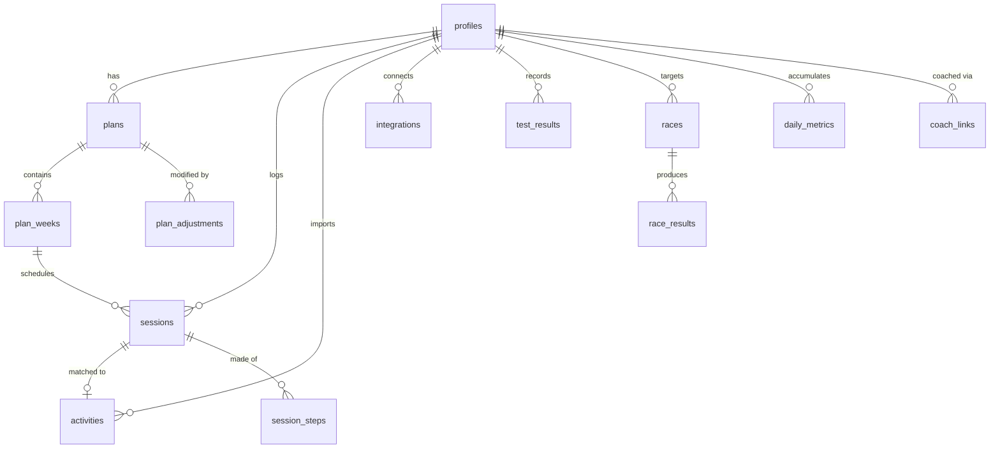

# 04 — Data Model

Postgres on Supabase. Every table is protected by Row Level Security; the app never uses the service-role key from client code.

## Conventions

- `uuid` primary keys, `gen_random_uuid()` default.
- `created_at` / `updated_at` `timestamptz` on every table, `updated_at` maintained by trigger.
- Dates the athlete perceives as *days* (session dates, race dates) are `date`, not `timestamptz` — a session belongs to a calendar day in the athlete's local timezone, and storing an instant creates timezone bugs at exactly the wrong moment.
- Durations in **seconds**, distances in **metres**, pace in **seconds per unit**. All conversion happens in the UI layer.
- Enums are Postgres `enum` types where the set is closed and stable, `text` + check constraint where it may grow.
- Soft delete only where the user might want undo (`deleted_at`); everything else is hard-deleted.
- `id_ext` columns store third-party IDs and carry unique constraints for idempotent imports.

---

## Entity overview



---

## Core tables

### `profiles`
Extends `auth.users` 1:1.

```sql
create type experience_tier as enum ('first_timer', 'improver', 'experienced');
create type unit_system     as enum ('metric', 'imperial');
create type swim_track      as enum ('learn', 'develop', 'refine');

create table profiles (
  id                uuid primary key references auth.users(id) on delete cascade,
  display_name      text,
  avatar_url        text,
  timezone          text not null default 'UTC',
  units             unit_system not null default 'metric',
  date_of_birth     date,
  experience_tier   experience_tier not null default 'first_timer',
  training_age_months smallint not null default 0,

  -- capability snapshot (updated by tests and imports)
  swim_continuous_m       integer,
  swim_css_sec_per_100m   integer,
  swim_track              swim_track not null default 'develop',
  bike_continuous_sec     integer,
  bike_ftp_watts          integer,
  bike_lthr               smallint,
  run_continuous_sec      integer,
  run_threshold_sec_per_km integer,
  run_lthr                smallint,
  max_hr                  smallint,
  resting_hr              smallint,

  -- context
  confidence        jsonb not null default '{"swim":2,"bike":2,"run":2}'::jsonb,
  availability      jsonb not null default '{}'::jsonb,  -- { days:[], minutesPerDay:{}, longDays:[] }
  equipment         jsonb not null default '{}'::jsonb,
  constraints       jsonb not null default '{}'::jsonb,  -- { injuries:[], blackoutDates:[] }

  onboarding_step   smallint not null default 0,
  onboarding_completed_at timestamptz,

  created_at timestamptz not null default now(),
  updated_at timestamptz not null default now()
);
```

`jsonb` is used deliberately for onboarding-shaped blobs that the training engine reads whole and no query ever filters on. Anything queried gets a column.

### `races`

```sql
create type race_distance as enum
  ('super_sprint','sprint','olympic','half','full','duathlon','aquabike','custom');
create type race_priority as enum ('a','b','c');
create type water_type    as enum ('pool','lake','river','sea','unknown');

create table races (
  id            uuid primary key default gen_random_uuid(),
  user_id       uuid not null references profiles(id) on delete cascade,
  name          text not null,
  race_date     date not null,
  distance      race_distance not null,
  priority      race_priority not null default 'a',
  location      text,
  water_type    water_type not null default 'unknown',
  water_temp_c  numeric(4,1),
  wetsuit_legal boolean,
  swim_m        integer, bike_m integer, run_m integer,   -- for 'custom'
  elevation_bike_m integer,
  notes         text,
  created_at timestamptz not null default now(),
  updated_at timestamptz not null default now()
);
create index on races (user_id, race_date);
```

### `plans` / `plan_weeks`

```sql
create type plan_status as enum ('draft','active','completed','abandoned');
create type plan_phase  as enum ('prep','base','build','peak','taper','race','recovery');

create table plans (
  id            uuid primary key default gen_random_uuid(),
  user_id       uuid not null references profiles(id) on delete cascade,
  race_id       uuid references races(id) on delete set null,
  status        plan_status not null default 'draft',
  start_date    date not null,
  end_date      date not null,
  goal_mode     text not null default 'race',      -- 'race' | 'fitness' | 'finish_only'
  generator_version text not null,                  -- reproducibility
  generator_input   jsonb not null,                 -- exact profile+goal snapshot used
  created_at timestamptz not null default now(),
  updated_at timestamptz not null default now()
);
-- at most one active plan per user
create unique index one_active_plan on plans (user_id) where status = 'active';

create table plan_weeks (
  id            uuid primary key default gen_random_uuid(),
  plan_id       uuid not null references plans(id) on delete cascade,
  week_index    smallint not null,          -- 0-based from plan start
  start_date    date not null,
  phase         plan_phase not null,
  is_recovery   boolean not null default false,
  target_load   numeric(7,1) not null,
  target_seconds integer not null,
  focus         text,                        -- "Aerobic base + swim technique"
  created_at timestamptz not null default now(),
  unique (plan_id, week_index)
);
```

`generator_input` + `generator_version` make every plan reproducible — essential for debugging "why did it give me this?" and for regression-testing generator changes against real inputs.

### `sessions`
The central table. A row exists for planned, completed, and ad-hoc sessions.

```sql
create type discipline     as enum ('swim','bike','run','brick','strength','mobility','rest','race');
create type session_status as enum ('planned','completed','partial','skipped','missed');
create type skip_reason    as enum ('ill','injured','travel','life','tired','weather','other');

create table sessions (
  id              uuid primary key default gen_random_uuid(),
  user_id         uuid not null references profiles(id) on delete cascade,
  plan_id         uuid references plans(id) on delete cascade,
  plan_week_id    uuid references plan_weeks(id) on delete cascade,

  date            date not null,
  discipline      discipline not null,
  template_id     text,                       -- e.g. 'bike.threshold'
  title           text not null,
  purpose         text not null,
  tags            text[] not null default '{}',

  -- planned
  planned_seconds integer,
  planned_meters  integer,
  planned_load    numeric(6,1),
  steps           jsonb not null default '[]'::jsonb,   -- Step[]; see 03-training-model

  -- actual
  status          session_status not null default 'planned',
  actual_seconds  integer,
  actual_meters   integer,
  actual_load     numeric(6,1),
  rpe             smallint check (rpe between 1 and 10),
  avg_hr          smallint,
  max_hr          smallint,
  avg_power       smallint,
  weighted_power  smallint,
  elevation_m     integer,
  body_check      text check (body_check in ('fine','niggle','pain')),
  note            text,
  completed_at    timestamptz,
  skip_reason     skip_reason,

  activity_id     uuid references activities(id) on delete set null,

  -- offline sync
  client_id       text,                       -- client-generated idempotency key
  client_updated_at timestamptz,

  created_at timestamptz not null default now(),
  updated_at timestamptz not null default now()
);

create index on sessions (user_id, date);
create index on sessions (plan_id, date);
create index on sessions (user_id, status) where status = 'planned';
create unique index on sessions (user_id, client_id) where client_id is not null;
```

`client_id` is what makes offline logging safe: the client mints a UUID before the request, and a replayed mutation upserts rather than duplicating.

### `session_steps`
Steps live in `sessions.steps` as `jsonb` for read performance (they're always fetched with their session and never queried across sessions). A normalized table is deliberately **not** used — see [ADR-0004](adr/0004-jsonb-for-session-steps.md).

### `activities`
Raw imports from third parties, kept separate from `sessions` so re-matching is always possible and deleting a plan never destroys real training history.

```sql
create type activity_source as enum ('strava','garmin','apple_health','health_connect','manual','app');

create table activities (
  id             uuid primary key default gen_random_uuid(),
  user_id        uuid not null references profiles(id) on delete cascade,
  source         activity_source not null,
  external_id    text,
  discipline     discipline not null,
  started_at     timestamptz not null,
  local_date     date not null,
  duration_sec   integer not null,
  moving_sec     integer,
  distance_m     integer,
  avg_hr smallint, max_hr smallint,
  avg_power smallint, weighted_power smallint,
  elevation_m integer,
  calories integer,
  name           text,
  raw            jsonb,                    -- provider payload, for reprocessing
  streams_url    text,                     -- lazily-fetched detail in Storage
  imported_at    timestamptz not null default now(),
  unique (user_id, source, external_id)
);
create index on activities (user_id, local_date);
```

### `daily_metrics`
One row per user per day — the load model's materialized output, plus optional wellness inputs.

```sql
create table daily_metrics (
  user_id     uuid not null references profiles(id) on delete cascade,
  date        date not null,
  load        numeric(7,1) not null default 0,
  fitness     numeric(7,2) not null default 0,   -- 42d EWMA
  fatigue     numeric(7,2) not null default 0,   -- 7d EWMA
  freshness   numeric(7,2) not null default 0,
  resting_hr  smallint,
  hrv_ms      smallint,
  sleep_sec   integer,
  sleep_quality smallint check (sleep_quality between 1 and 5),
  soreness    smallint check (soreness between 1 and 5),
  motivation  smallint check (motivation between 1 and 5),
  readiness   smallint check (readiness between 0 and 100),
  primary key (user_id, date)
);
```

Recomputed forward from the earliest changed day whenever a session is logged or an activity imported. Cheap: it's a single pass over ≤ 365 rows.

### `test_results`

```sql
create type test_kind as enum ('run_threshold','bike_ftp','swim_css','swim_400','swim_200');

create table test_results (
  id         uuid primary key default gen_random_uuid(),
  user_id    uuid not null references profiles(id) on delete cascade,
  session_id uuid references sessions(id) on delete set null,
  kind       test_kind not null,
  date       date not null,
  raw_value  numeric(8,2) not null,       -- watts, sec/km, sec/100m
  derived    jsonb not null,              -- { ftp: 210, lthr: 168, zones: {...} }
  created_at timestamptz not null default now()
);
create index on test_results (user_id, kind, date desc);
```

### `plan_adjustments`
The audit trail behind "what changed and why", and the undo mechanism.

```sql
create table plan_adjustments (
  id          uuid primary key default gen_random_uuid(),
  user_id     uuid not null references profiles(id) on delete cascade,
  plan_id     uuid not null references plans(id) on delete cascade,
  rule_id     text not null,               -- 'A4'
  type        text not null,
  reason      text not null,               -- shown verbatim to the user
  magnitude   numeric(4,2),
  affected_session_ids uuid[] not null default '{}',
  snapshot    jsonb not null,              -- pre-change state, for undo
  applied_at  timestamptz not null default now(),
  reverted_at timestamptz,
  seen_at     timestamptz
);
create index on plan_adjustments (user_id, applied_at desc);
```

### `integrations`

```sql
create table integrations (
  id             uuid primary key default gen_random_uuid(),
  user_id        uuid not null references profiles(id) on delete cascade,
  provider       activity_source not null,
  external_user_id text,
  access_token   text not null,            -- encrypted at rest, see below
  refresh_token  text,
  expires_at     timestamptz,
  scopes         text[],
  webhook_id     text,
  last_sync_at   timestamptz,
  last_error     text,
  status         text not null default 'active',   -- active | expired | revoked
  created_at timestamptz not null default now(),
  updated_at timestamptz not null default now(),
  unique (user_id, provider)
);
```

**Tokens are never exposed to the client.** RLS grants users `select` on every column *except* the token columns via a restricted view (`integrations_public`); the raw table is readable only by the service role in server-side routes. Tokens are encrypted with `pgsodium` / Supabase Vault.

### `race_results`

```sql
create table race_results (
  id           uuid primary key default gen_random_uuid(),
  user_id      uuid not null references profiles(id) on delete cascade,
  race_id      uuid not null references races(id) on delete cascade,
  finished     boolean not null,
  total_sec    integer,
  swim_sec integer, t1_sec integer, bike_sec integer, t2_sec integer, run_sec integer,
  overall_place integer, category_place integer, field_size integer,
  reflection   text,
  photo_url    text,
  created_at timestamptz not null default now()
);
```

### `checklists`

```sql
create table checklists (
  id       uuid primary key default gen_random_uuid(),
  user_id  uuid not null references profiles(id) on delete cascade,
  race_id  uuid references races(id) on delete cascade,
  kind     text not null,                 -- 'gear' | 'travel' | 'morning'
  items    jsonb not null,                -- [{ id, label, group, checked, custom }]
  updated_at timestamptz not null default now()
);
```

### `content_modules` / `module_progress`
Confidence & skills content ([F-12](01-product-spec.md#f-12--confidence--skills-track--p1)). Content ships as MDX in the repo and is *registered* in the DB only for trigger rules and progress tracking.

```sql
create table content_modules (
  id          text primary key,            -- 'openwater.first-swim'
  title       text not null,
  category    text not null,
  read_seconds smallint not null,
  trigger     jsonb not null,              -- { beforeTag:'openwater', minDaysBefore:7 }
  required    boolean not null default false,
  version     smallint not null default 1
);

create table module_progress (
  user_id   uuid not null references profiles(id) on delete cascade,
  module_id text not null references content_modules(id) on delete cascade,
  opened_at timestamptz,
  completed_at timestamptz,
  dismissed_at timestamptz,
  primary key (user_id, module_id)
);
```

---

## Phase 4 tables

```sql
create type link_status as enum ('pending','active','revoked');

create table coach_links (
  id          uuid primary key default gen_random_uuid(),
  coach_id    uuid not null references profiles(id) on delete cascade,
  athlete_id  uuid not null references profiles(id) on delete cascade,
  status      link_status not null default 'pending',
  scopes      text[] not null default '{plan}',   -- plan | logs | metrics | all
  invited_at  timestamptz not null default now(),
  accepted_at timestamptz,
  revoked_at  timestamptz,
  unique (coach_id, athlete_id)
);

create table session_comments (
  id         uuid primary key default gen_random_uuid(),
  session_id uuid not null references sessions(id) on delete cascade,
  author_id  uuid not null references profiles(id) on delete cascade,
  body       text not null,
  created_at timestamptz not null default now()
);

create table follows (
  follower_id uuid not null references profiles(id) on delete cascade,
  followee_id uuid not null references profiles(id) on delete cascade,
  created_at  timestamptz not null default now(),
  primary key (follower_id, followee_id)
);
```

---

## Row Level Security

RLS is enabled on **every** table. The baseline policy set, applied to all user-owned tables:

```sql
alter table sessions enable row level security;

create policy "own rows: select" on sessions
  for select using (auth.uid() = user_id);
create policy "own rows: insert" on sessions
  for insert with check (auth.uid() = user_id);
create policy "own rows: update" on sessions
  for update using (auth.uid() = user_id) with check (auth.uid() = user_id);
create policy "own rows: delete" on sessions
  for delete using (auth.uid() = user_id);
```

Coach access (Phase 4) is additive and scope-checked:

```sql
create policy "coach can read athlete sessions" on sessions
  for select using (
    exists (
      select 1 from coach_links cl
      where cl.athlete_id = sessions.user_id
        and cl.coach_id   = auth.uid()
        and cl.status     = 'active'
        and ('logs' = any(cl.scopes) or 'all' = any(cl.scopes))
    )
  );
```

Rules:
- No table is ever left without RLS, including join tables.
- `service_role` is used only in server-side route handlers and webhook receivers, never shipped to the client.
- Every policy has a corresponding test in `tests/rls/` that asserts a second user **cannot** read or write the first user's rows. This is the one test suite that must never be skipped.

---

## Indexes & performance

Beyond the indexes declared above:

```sql
-- Today screen: one query, one index
create index sessions_user_date_status on sessions (user_id, date, status);

-- Calendar month view
create index sessions_user_month on sessions (user_id, date) include (discipline, status, planned_seconds);

-- Chart series
create index daily_metrics_user_date on daily_metrics (user_id, date desc);

-- Webhook dedupe (already unique, but hot)
create index activities_lookup on activities (user_id, source, external_id);
```

Expected data volume per active user per year: ~250 sessions, ~250 activities, 365 daily metrics. Everything fits comfortably in memory; no partitioning needed at any realistic scale.

---

## Migrations

- Supabase CLI migrations in `supabase/migrations/`, one file per change, timestamped, checked in.
- Every migration is forward-only and safe to run on a live table: add columns nullable, backfill, then constrain.
- Enum values may only be **added**, never removed or reordered.
- Seed data (`content_modules`, workout templates) lives in `supabase/seed.sql` and is idempotent.

---

## Data export & deletion

- **Export** (`GET /api/me/export`): a single JSON document containing every row owned by the user, plus GPX/FIT files from Storage where available. Generated as a background job, delivered as a signed URL.
- **Delete**: `on delete cascade` from `auth.users` removes everything. Integration tokens are revoked with the provider *before* the row is dropped. Storage objects are purged by a scheduled job within 30 days.
