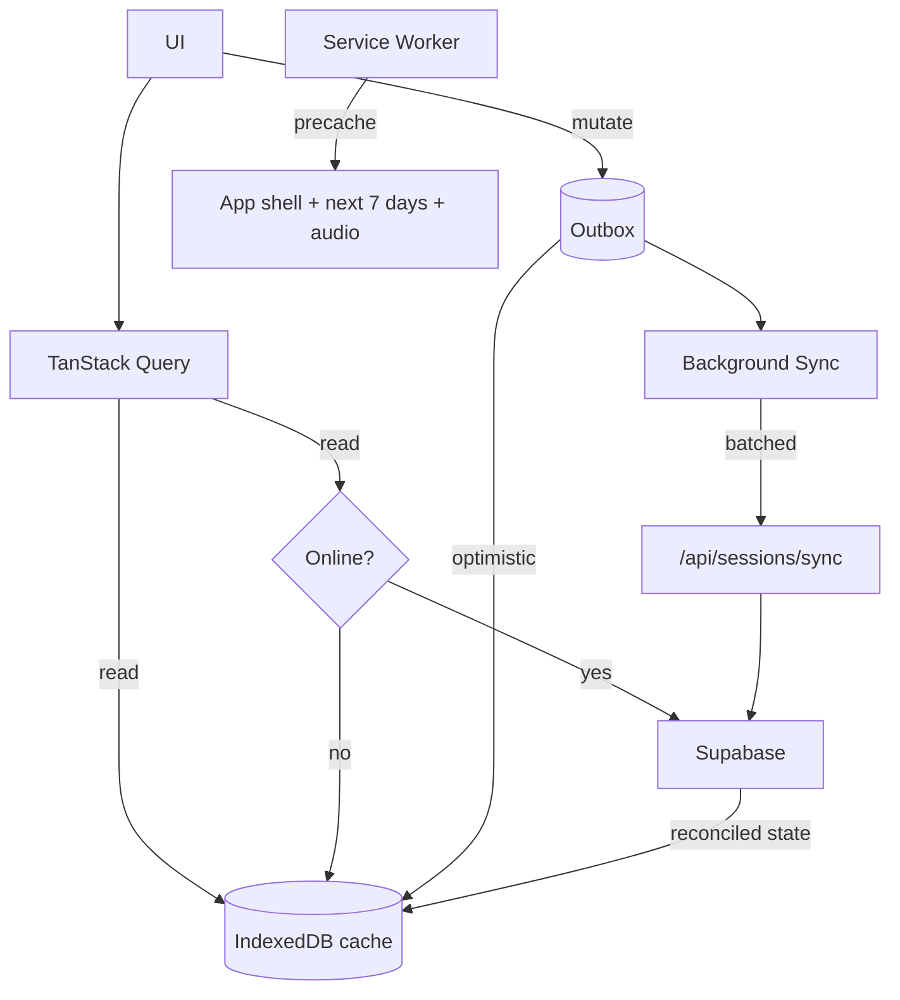

# 05 — Architecture

## Stack

| Layer            | Choice                                                     | Why                                                                                                                           |
| ---------------- | ---------------------------------------------------------- | ----------------------------------------------------------------------------------------------------------------------------- |
| Framework        | **Next.js 15**, App Router, TypeScript strict              | Server Components keep the client bundle small on mobile; route handlers give us webhook endpoints without a separate service |
| Styling          | **Tailwind CSS** + CSS variables for tokens                | Fast, small, no runtime cost; tokens keep theming honest                                                                      |
| UI primitives    | **Radix UI** (unstyled) + local component layer            | Accessibility (focus, ARIA, dismissal) solved properly, styled by us                                                          |
| State (server)   | **TanStack Query** with a persisted IndexedDB cache        | Offline reads, background refetch, optimistic mutations, retry queue                                                          |
| State (client)   | **Zustand** for live-workout state only                    | Everything else is server state; a global store would be a liability                                                          |
| Backend          | **Supabase** — Postgres, Auth, Storage, Realtime           | Managed Postgres with RLS means authorization lives next to the data                                                          |
| Offline          | Custom **service worker** via Serwist + IndexedDB (Dexie)  | We need workout-specific caching rules, not a generic recipe                                                                  |
| Charts           | **visx** or lightweight SVG                                | Recharts/Chart.js are too heavy for the mobile budget                                                                         |
| Validation       | **Zod**, shared client/server                              | One schema per boundary, inferred types                                                                                       |
| Testing          | Vitest (unit), Playwright (e2e incl. offline), pgTAP (RLS) |                                                                                                                               |
| Hosting          | **Vercel** + Vercel Cron                                   | Preview deploys per PR, edge caching, scheduled jobs                                                                          |
| Errors/analytics | Sentry + self-hosted PostHog (or none)                     | No data brokers on health data — see [00-vision](00-vision.md#non-goals)                                                      |

Rationale for the big calls is in [ADR-0001](adr/0001-nextjs-supabase-pwa.md) and [ADR-0002](adr/0002-offline-first-pwa.md).

---

## Directory structure

```
afraid-to-tri/
├── app/
│   ├── (marketing)/               # public landing, no auth
│   ├── (onboarding)/
│   │   └── start/[step]/
│   ├── (app)/                     # authenticated shell + bottom nav
│   │   ├── today/
│   │   ├── calendar/
│   │   ├── session/[id]/
│   │   ├── live/[id]/             # live workout — own layout, no nav chrome
│   │   ├── progress/
│   │   ├── race/[id]/             # race toolkit + race mode
│   │   └── me/
│   ├── api/
│   │   ├── plan/generate/
│   │   ├── sessions/sync/         # batched offline mutation replay
│   │   ├── webhooks/strava/
│   │   ├── webhooks/garmin/
│   │   ├── integrations/[provider]/callback/
│   │   ├── cron/nightly/
│   │   └── me/export/
│   ├── manifest.ts
│   └── layout.tsx
├── components/
│   ├── ui/                        # button, sheet, card, chip — the design system
│   ├── session/
│   ├── live/
│   ├── charts/
│   └── content/                   # MDX renderers for confidence modules
├── lib/
│   ├── training/                  # ⭐ pure domain — no I/O, fully unit-tested
│   │   ├── zones.ts
│   │   ├── load.ts
│   │   ├── generate/              # plan generator, split by step
│   │   ├── adapt.ts
│   │   ├── predict.ts
│   │   ├── safety.ts              # rail validator; every plan passes through it
│   │   └── templates/             # workout library
│   ├── supabase/                  # client / server / admin factories
│   ├── sync/                      # outbox, conflict resolution, replay
│   ├── integrations/              # strava.ts, garmin.ts, health.ts
│   ├── audio/                     # cue scheduling + speech
│   └── format/                    # units, durations, paces, i18n strings
├── content/                       # MDX: confidence modules, glossary, walkthroughs
├── supabase/
│   ├── migrations/
│   └── seed.sql
├── tests/
│   ├── unit/
│   ├── rls/
│   └── e2e/
├── public/
└── docs/
```

**The rule that matters:** `lib/training/` never imports from `lib/supabase/`, `app/`, or anything with I/O. It takes plain objects and returns plain objects. That's what makes the domain testable and what lets us regenerate any historical plan from `plans.generator_input`.

---

## Rendering strategy

| Route            | Strategy                                             | Reason                                            |
| ---------------- | ---------------------------------------------------- | ------------------------------------------------- |
| Marketing        | Static                                               | Cacheable at the edge                             |
| Onboarding       | Client-heavy, server actions for persistence         | Highly interactive, needs to work pre-auth        |
| Today            | RSC shell + client island for the hero card          | Fast first paint; the interactive part is small   |
| Calendar         | RSC for the month, client for drag/drop              |                                                   |
| Session detail   | RSC                                                  | Mostly static content                             |
| **Live workout** | **Fully client, no server calls during the session** | Must run offline; any network dependency is a bug |
| Progress         | RSC + client charts                                  | Data fetched server-side, rendered client-side    |
| Race mode        | Client, pre-cached                                   | Race venues have no signal                        |

Server Components are the default. A `'use client'` boundary needs a reason: interactivity, browser API, or offline requirement.

---

## Offline architecture

The hardest requirement in the app, and the one that shapes everything else.



### Caching tiers

| Tier                   | Content                                                                    | Strategy                                    |
| ---------------------- | -------------------------------------------------------------------------- | ------------------------------------------- |
| Precache               | App shell, fonts, icons, offline fallback page                             | Cache-first, versioned by build             |
| Aggressive prefetch    | Next 7 days of sessions, their steps, their audio cues, all safety content | Cached on login and refreshed nightly       |
| Stale-while-revalidate | Plan, profile, progress data                                               | Serve cache instantly, update in background |
| Network-only           | Auth, integrations, export                                                 | Never useful offline                        |

### The outbox

Every mutation the user can make offline (log, skip, move, note, checklist tick) goes through one path:

1. Client mints a `client_id` (UUID) and writes the mutation to the IndexedDB outbox.
2. The optimistic result is applied to the local cache immediately — the UI never waits.
3. Background Sync (or app-focus fallback, since iOS lacks Background Sync) posts the batch to `/api/sessions/sync`.
4. The server upserts on `(user_id, client_id)`, making replay idempotent.
5. The server returns reconciled rows; the client replaces its optimistic state.
6. On permanent failure (4xx), the mutation is parked and surfaced to the user — **never silently discarded**.

### Conflict policy

- **Session logs: client always wins.** The athlete was there; the server was not.
- **Plan structure: server wins.** The generator is authoritative.
- **Profile fields: last-write-wins per field**, using `client_updated_at`.
- **Checklists: merge by item id**, union of checked states.

### Live-workout durability

- Session definition + audio cached before the Start button is enabled. If assets aren't cached, the button shows "Preparing…" rather than starting a session that will fail mid-way.
- Timer state checkpointed to IndexedDB every 5 s.
- Elapsed time computed from wall-clock deltas, never from accumulated `setInterval` ticks — background throttling would otherwise drift badly.
- Wake Lock API while active, released on pause and on visibility loss.

---

## Background jobs

Vercel Cron hitting authenticated route handlers (bearer secret in `CRON_SECRET`).

| Job              | Schedule                  | Work                                                                                            |
| ---------------- | ------------------------- | ----------------------------------------------------------------------------------------------- |
| `nightly`        | 02:00 per-timezone bucket | Mark missed sessions, run the adaptation engine, recompute `daily_metrics`, queue notifications |
| `token-refresh`  | Hourly                    | Refresh integration tokens expiring within 24 h                                                 |
| `prefetch-warm`  | Daily                     | Nothing server-side; sends a silent push that prompts clients to refresh their 7-day cache      |
| `export-cleanup` | Daily                     | Delete expired export artifacts                                                                 |
| `deletion-sweep` | Daily                     | Hard-delete accounts past their 30-day window                                                   |

The nightly job is **idempotent and resumable** — it processes users in batches with a cursor, so a timeout never leaves half the user base un-adapted.

---

## Security

- **RLS everywhere**; the publishable key is the only key that reaches the browser.
- The secret key is used only in route handlers, never in a Client Component. `lib/supabase/admin.ts` imports `server-only`, which turns a stray client import into a build error, and all environment access goes through `lib/env.ts` (lint-enforced).
- Integration tokens encrypted at rest (Supabase Vault) and never returned to the client.
- Webhooks verify provider signatures (Strava verify token, Garmin signature) and are rate-limited.
- CSP with no `unsafe-inline`; strict `frame-ancestors`.
- Rate limits on plan generation (expensive) and auth endpoints.
- No health data in logs or error reports — Sentry scrubbing configured with an explicit allowlist, not a denylist.

---

## Performance budget

Enforced in CI; a PR that breaks the budget fails.

| Metric                                    | Budget                    |
| ----------------------------------------- | ------------------------- |
| Initial JS (gzipped)                      | ≤ 180 KB                  |
| LCP (Moto G4 / slow 4G)                   | ≤ 2.0 s                   |
| INP                                       | ≤ 200 ms                  |
| CLS                                       | ≤ 0.05                    |
| Lighthouse Performance / PWA / A11y       | ≥ 90 / ≥ 90 / 100         |
| Live-workout battery (60 min, screen off) | ≤ 12% on reference device |

Techniques: RSC by default, route-level code splitting, `next/font` with subsetting, no icon font (inline SVG), charts loaded only on the Progress route, no moment/lodash-scale dependencies.

---

## Environments

| Env        | Branch | Supabase               | Notes                                                         |
| ---------- | ------ | ---------------------- | ------------------------------------------------------------- |
| Local      | any    | Local Supabase via CLI | Seeded with a demo athlete and a 14-week plan                 |
| Preview    | PR     | Shared staging project | Every PR gets a URL; integrations point at provider sandboxes |
| Production | `main` | Production project     | Protected; migrations run via CI on merge                     |

### Environment variables

```
NEXT_PUBLIC_SUPABASE_URL
NEXT_PUBLIC_SUPABASE_PUBLISHABLE_KEY   # sb_publishable_… — public by design, RLS protects it
SUPABASE_SECRET_KEY                    # sb_secret_… — server only, BYPASSES RLS
STRAVA_CLIENT_ID / STRAVA_CLIENT_SECRET / STRAVA_WEBHOOK_VERIFY_TOKEN
GARMIN_CONSUMER_KEY / GARMIN_CONSUMER_SECRET
VAPID_PUBLIC_KEY / VAPID_PRIVATE_KEY      # web push
CRON_SECRET
WEATHER_API_KEY                            # Phase 2
SENTRY_DSN
```

---

## CI/CD

On every PR: typecheck → lint → unit tests → RLS tests against an ephemeral database → build → Lighthouse CI on the preview → Playwright e2e (including an offline scenario).

On merge to `main`: run migrations, deploy, smoke-test, tag.

**Migrations always run before the deploy** and must be backward-compatible with the currently-deployed code, since the two are briefly out of step.

---

## Observability

- Structured logs with a request id; user id hashed, never raw.
- Metrics that matter: plan generation latency and failure rate, sync queue depth and replay failures, webhook processing lag, live-session crash/resume rate.
- Alerts: sync failure rate > 1%, webhook lag > 15 min, nightly job incomplete, error rate spike.
- A generator failure is a **P1** — a user without a plan has no product.
